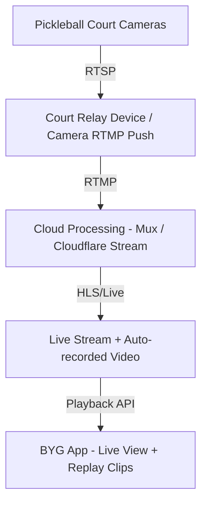

# Pickleball Live Streaming + Instant Replay System

This document outlines the implementation plan for a live streaming and instant replay system built into the BYG (Book Your Ground) platform, specifically for pickleball courts.

---

## The Full System Architecture



---

## Hardware — Camera Installation

Each court requires a minimum of **2 cameras** for a comprehensive experience:

| Camera Position | Quality | Purpose |
|-----------------|---------|---------|
| **Wide Angle** (High Corner) | 4K | Full match recording and general overview |
| **Side Camera** (Net Height) | 1080p | Volley details, close plays, and player expressions |

**Recommended Hardware:**
- **Reolink RLC-810A** (₹6,000–8,000): PoE, 4K, outdoor-rated, supports RTMP/RTSP.
- **Hikvision DS-2CD2143G2** (₹8,000–12,000): Enterprise grade, superior low-light performance for indoor courts.

---

## Streaming Infrastructure

### 1. Mux (Recommended)
A developer-first video API that handles live streaming, recording, clip generation, and optimized playback.
- **Workflow**: Camera → RTMP Push → Mux Ingest → Mux Playback URL.
- **Cost**: ~$0.015/min live + $0.008/min storage. (~₹250 for a 2-hour match including storage).

### 2. Cloudflare Stream
A cost-effective alternative for high-volume storage.
- **Cost**: ~$5 per 1,000 minutes delivered.

### 3. Self-hosted (Nginx RTMP)
For large-scale deployments where minimizing OpEx is critical.
- **Pros**: Lowest running cost (VPS only).
- **Cons**: High complexity, no built-in clipping API, requires manual recording management.

---

## Camera-to-Cloud Setup

Install a **Raspberry Pi 4** or similar small-form-factor PC as a relay device on each court to bridge the camera to the cloud.

```bash
# FFmpeg relay command
# Converts RTSP stream from camera to RTMP for Mux ingest
ffmpeg \
  -i rtsp://camera-ip:554/stream \
  -c:v libx264 \
  -preset veryfast \
  -b:v 3000k \
  -maxrate 3000k \
  -bufsize 6000k \
  -pix_fmt yuv420p \
  -g 50 \
  -c:a aac \
  -b:a 128k \
  -f flv \
  rtmp://live.mux.com/app/YOUR_STREAM_KEY
```

---

## Instant Replay Feature

Mux's **Clips API** allows for near-instant generation of replay segments from a live stream.

### Clip Generation Workflow (Supabase Edge Function)
```ts
// create-clip Edge Function
const clip = await fetch('https://api.mux.com/video/v1/assets', {
  method: 'POST',
  headers: {
    'Authorization': 'Basic ' + btoa(`${MUX_TOKEN_ID}:${MUX_TOKEN_SECRET}`),
    'Content-Type': 'application/json'
  },
  body: JSON.stringify({
    input: `mux://live-streams/${liveStreamId}`,
    playback_policy: ['public'],
    start: currentStreamTime - 30, // Last 30 seconds
    end: currentStreamTime
  })
})
```

**Player Experience**: 
1. Player taps **"Replay Last Rally"** on the BYG app.
2. App triggers Edge Function.
3. Mux generates clip in ~3-5 seconds.
4. Clip appears in the "Recent Highlights" reel via Supabase Realtime.

---

## Database Schema (Supabase)

```sql
-- Store match stream metadata
create table court_streams (
  id              uuid primary key default gen_random_uuid(),
  ground_id       uuid references grounds(id),
  court_number    int,
  booking_id      uuid references bookings(id),
  mux_stream_id   text,
  mux_playback_id text,
  status          text default 'idle', -- idle | live | ended
  started_at      timestamptz,
  ended_at        timestamptz
);

-- Store generated replay clips
create table match_clips (
  id              uuid primary key default gen_random_uuid(),
  stream_id       uuid references court_streams(id),
  booking_id      uuid references bookings(id),
  mux_asset_id    text,
  mux_playback_id text,
  clip_start      numeric, -- seconds into stream
  clip_end        numeric,
  label           text,    -- "Rally 1", "Great Volley", etc.
  created_by      uuid references profiles(id),
  created_at      timestamptz default now()
);
```

---

## Business Model & Costs

### Initial Setup (Per Court)
| Item | Estimated Cost |
|------|----------------|
| 2× 4K Cameras | ₹14,000 |
| Raspberry Pi 4 Relay | ₹4,000 |
| PoE Switch & Cabling | ₹3,000 |
| **Total Hardware** | **₹21,000** |

### Operational Cost (Per Match)
- **Streaming & Storage**: ~₹250 per 2-hour match.
- **Monetization**: Charge a **"Smart Match"** premium of ₹300–500 per booking to provide players with live views, instant replays, and a full recording download.

---

## Implementation Roadmap

- [ ] **Phase 1**: Hardware prototype on one court + basic live view in app.
- [ ] **Phase 2**: Implement Replay Button, Edge Functions for clipping, and Realtime highlights reel.
- [ ] **Phase 3**: Post-match download links and AI-powered automatic rally detection (auto-clipping).
